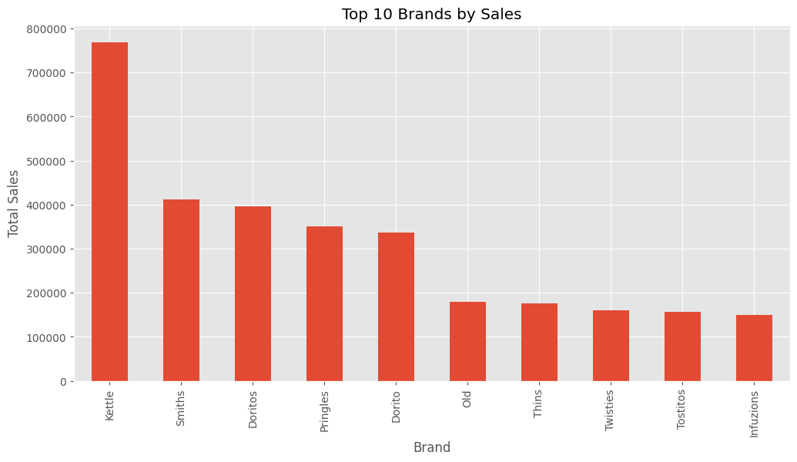
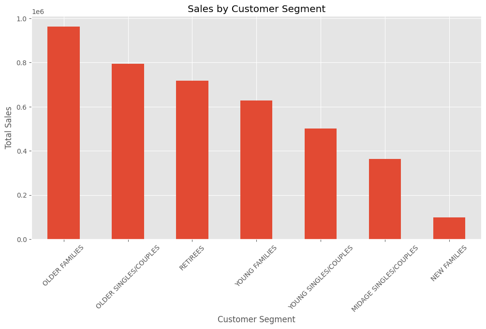
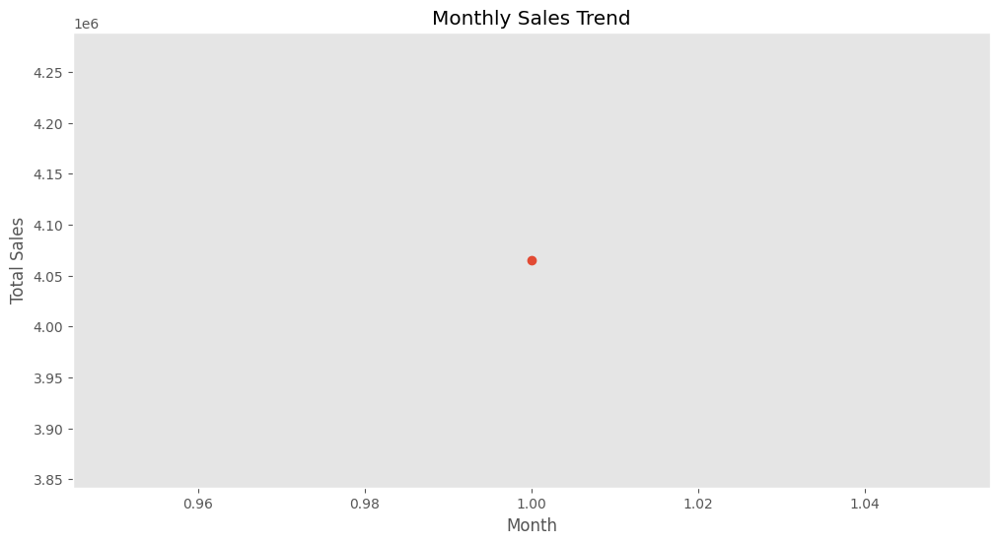
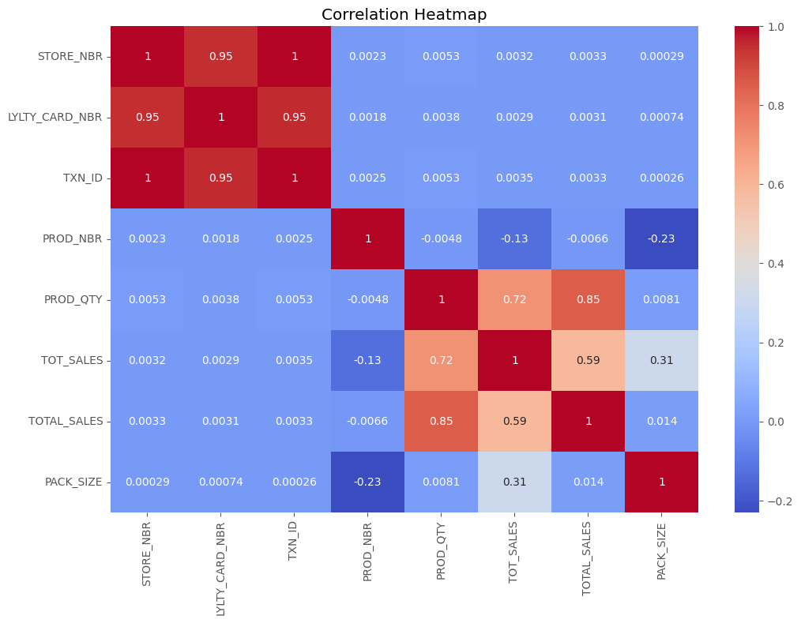
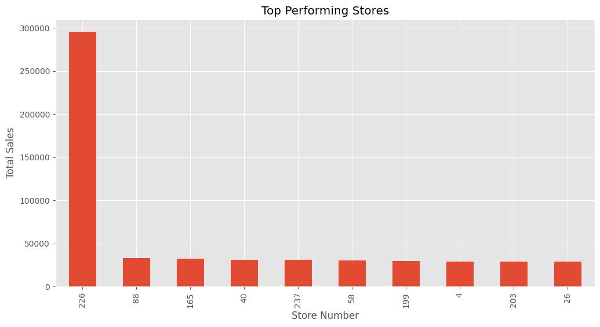

# Quantium Retail Analytics Project

## 🎯 Problem Statement

Analyze retail transaction and customer purchasing behavior data to uncover business insights, identify sales trends, and evaluate store performance for better retail decision-making.

---

## 📌 Project Overview

This project focuses on retail analytics using transaction and customer data provided by Quantium.

The analysis includes:
- Customer purchasing behavior
- Brand performance
- Pack size analysis
- Monthly sales trends
- Store performance evaluation
- Correlation analysis

The project aims to generate actionable business insights through data cleaning, exploratory data analysis, and visualization techniques.

---

## 🛠️ Tools & Technologies

- Python
- Pandas
- NumPy
- Matplotlib
- Seaborn
- Jupyter Notebook
- Excel

---

## 📊 Analysis Performed

### ✅ Data Cleaning
- Checked missing values
- Removed duplicate records
- Converted date columns
- Merged transaction and customer datasets

### ✅ Feature Engineering
- Created Total Sales column
- Extracted product brands
- Extracted pack sizes

### ✅ Exploratory Data Analysis
- Customer segment analysis
- Top brand analysis
- Monthly sales trends
- Store performance analysis
- Correlation heatmap

---

## 📈 Key Insights

- Young singles and couples contribute significantly to sales revenue.
- Premium chip brands generate strong customer engagement.
- Medium and large pack sizes dominate customer purchases.
- Some stores consistently outperform others in sales.
- Sales trends indicate seasonal demand variations.

---

## 💡 Business Recommendations

- Increase inventory for high-performing pack sizes.
- Target premium product campaigns toward young professionals.
- Replicate successful strategies from top-performing stores.
- Optimize inventory planning based on monthly demand trends.

---

## 🖼️ Visualizations

### Top Brands by Sales



---

### Customer Segment Sales



---

### Monthly Sales Trend



---

### Correlation Heatmap



---

### Top Stores



## 📂 Project Structure

```bash
Quantium-Retail-Analytics/
│
├── data/
├── notebooks/
├── images/
├── README.md
├── requirements.txt
```

---

## ⚙️ How to Run

### 1️⃣ Clone Repository

```bash
git clone https://github.com/harshithaadicherla10/quantium-retail-analytics.git
```

### 2️⃣ Install Dependencies

```bash
pip install pandas numpy matplotlib seaborn
```

### 3️⃣ Open Jupyter Notebook

```bash
jupyter notebook
```

### 4️⃣ Run Notebook

Open:
```bash
notebooks/quantium_analysis.ipynb
```

---

## 🚀 Project Highlights

- Retail customer analytics
- Business-focused insights
- Data visualization
- Exploratory data analysis
- Store performance evaluation
- Correlation analysis
